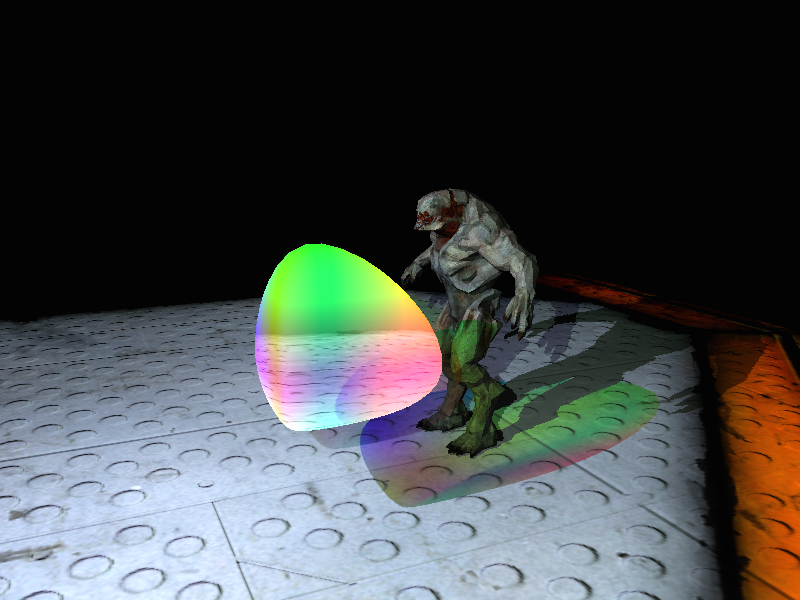

  
&nbsp; &nbsp; &nbsp; &nbsp;
  

This was my submission for my 3rd year module 'Graphics Programming with Shaders' at Abertay in 2015.

Demonstrates effects including lighting, shadow maps, transparency, geometry shaders, tesselation shaders, and more.

You can view the original report describing the project [here](docs/report.pdf).

To run, clone the project and run the executable located at `/exe/exe/Thomas_Hope_1302495.exe`
