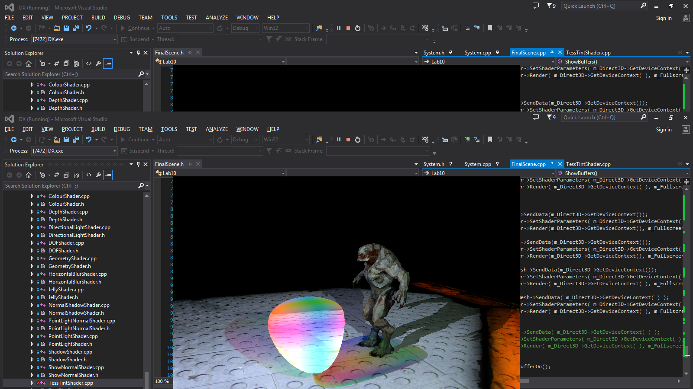

# Graphics Programming with Shaders
#### Coursework Documentation
#### AG0904A15
#### Thomas Hope: 1302495

## Preface

This document is a description of the techniques used for Thomas Hope's submission for module AG0904A15, Graphics Programming with Shaders. The module tutor was Dr Paul Robertson. The application was based on a framework provided by the module tutor written in C++. Shaders were written in HLSL for DirectX11.

## Overview
### Controls
* WASD: forward, left, back, right
* E: up
* Q: down
* Arrow Keys: rotate camera
* NUMPAD 0: show bonus scene
* NUMPAD 1: toggle normal display
* NUMPAD 2: increase tessellation
* NUMPAD 3: decrease tessellation
* NUMPAD 4: show lighting render stages
* NUMPAD 5: show tessellation render stages
* NUMPAD 6: show final scene

### Features
* multiple lights, ambient and diffuse
* per light attenuation
* per light shadow mapping
* per light specular highlights (see bonus scene)
* diffuse texturing
* normal mapping
* tessellation
* transparency
* vertex manipulation
* refraction
* light transmission
* geometry generation
* depth of field
* fog

### Buffers
* Shadow Map x 2
* Scene with light and shadow
* Magic sphere diffuse colours
* Magic sphere normals
* Scene with light and shadow, blended with magic sphere
* Blurred version of the blended scene

### Shaders
* Depth shader, renders depth values to texture alpha
* Texture shader, renders unlit mesh with texture
* Shadow shader, renders objects with light and shadow
* Normal shadow shader, renders objects with normal map, light and shadow
* Tess Colour shader, renders colour tint and depth to alpha information
* Tess normal shader, renders normal information for tessellated shape to texture RGB
* Blend Shader, blends two textures with refraction
* Show Normal Shader, highlights the edges of faces with a colour representing their normal
* Blur shader, modified box blur shader using sub pixel sampling
* Depth of field shader, blends a sharp and blurred texture based on depth from the screen centre 

### Objects
#### Floor
The scene floor is rendered into shadow maps 1 and 2, so it can receive shadows from the other objects in the scene, and into the lit scene with the shadows and normal maps applied.
#### Hellknight Model
The Hellknight is rendered into shadow maps 1 and 2, so it can cast and receive shadows from other objects in the scene, and into the lit scene with shadows and tints applied.
#### Magic Sphere
Th magic sphere starts its life as a cube, morphing into a sphere as the tessellation factor is increased. In order for the magic sphere to cast a colour tint, and refract objects behind it it is rendered multiple times. The depth pass writes depth and tint information into the depth buffer, the colour pass renders the diffuse colour, and the normal pass renders the surface normals into another buffer. Essential constructing a normal map for the sphere each frame.
### Bonus Scene
The bonus scene is included to give a more distinct demonstration of some lighting effects. Notably per light specular, attenuation, and range.

## Detail
#### Normal Maps
Normal maps are similar to the usual coloured (diffuse) textures in that they store additional information about the surface they are applied to. However instead of storing colour information they store information about the normal to the surface at each pixel.  
The XYZ direction of the normal is stored as an RGB colour value in tangent space. Tangent space is a coordinate system relative to the surface the normal map is being applied to. In tangent space 'up' is normally represented by the actual normal of the polygon and the other to axes (tangent and binormal) lie on the surface of the polygon perpendicular to each other and the normal.  
This additional tangent and binormal information needs to be passed to the pixel shader somehow, it could be incorporated into the mesh or calculated in a previous shader stage (of which the vertex or geometry shader are the most likely candidates). In the case of the floor I added the tangent and binormal information to the mesh. The normal, tangent and binormal are then multiplied by the worldMatrix in the vertex shader so they are orientated correctly to the surface.  
The normal map is passed into the pixel shader along with the diffuse texture and sampled at the same UV coordinate. The normal sample is then transformed from the range [0,1] to [-1,1], transformed from tangent space, and normalised (if the values in the texture have not been normalised already). All further lighting calculating are then done with this normal.
### Shadow Mapping
* render depth information to the alpha channel
* render tint information to the colour channel, preserving depth with blend mode
### Magic Sphere
* render colour info with depth to a buffer
* render normals to another buffer
* blend into the scene with depth information, use normals to refract sample
### Depth Of Field
* final scene is rendered with depth info to alpha buffer
* blur final scene
* sample in the middle, lerp based on difference
* apply fog
### Things to improve
* normal mapping on model (tried to use triangle adjacency, could try sending data when loading model)
* When light is falling on a normal mapped surface in the negative z and x direction the normal is incorrect

## References
* Paul Robertson, what a gent
* with help from [RasterTek Tutorials](http://www.rastertek.com/tutdx11.html)
